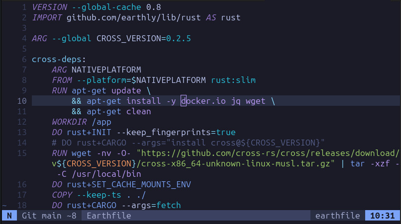

# tree-sitter-earthfile

A work-in-progress [tree-sitter](https://tree-sitter.github.io/) grammar for [Earthfile](https://docs.earthly.dev/docs/earthfile).

## License

`tree-sitter-earthfile` is distributed under the terms of the MIT license.

See [LICENSE](LICENSE) for details.
